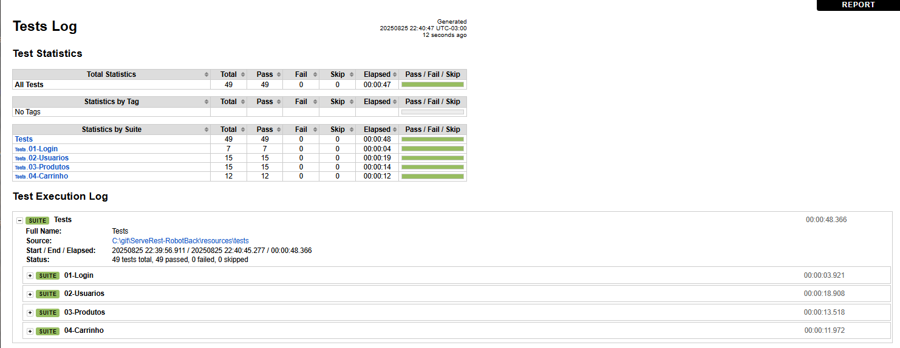

<h1 align="Center"> Teste de Automação API Com Robot Framework - ServeRest </h1>

<h2 align="center">
Teste API ServeRest
</h2>
<p> O ServeRest é uma api que simula uma loja virtual sendo disponibilizada gratuitamente para estudos. </p>
<p>Testes de endpoints: Login, Usuários, Produtos e Carrinho.</p>
<p>A API permite o cadastro de 2 tipos de usuário: usuário administrador e usuário não administrador. </p>
<p>Login: autenticação de usuários e gerenciamento de produtos (usuário administrador).</p>
<p>Usuários: gerenciamento de usuários, cadastro de admnistrador, CRUD de usuários. </p>
<p>Produtos: gerenciamento de produtos, CRUD de produtos. </p>
<p>Carrinhos: CRUD de carrinho, desistência de compra. </p>
<p> Acesso ao Swagger da API: https://serverest.dev/#/</p>
<p> Acesso ao repositório da API: https://github.com/ServeRest/ServeRest?tab=readme-ov-file</p>

### Funcionalidades

- [x] Realizar login;
- [x] Cadastrar usuário;
- [x] Listar usuários cadastrados;
- [x] Buscar usuário por id;
- [x] Editar usuário por id;
- [x] Excluir usuário;
- [x] Cadastrar produto;
- [x] Listar produtos cadastrados;
- [x] Buscar produto por id;
- [x] Editar produto por id;
- [x] Excluir produto;
- [x] Cadastrar carrinho;
- [x] Listar carrinhos cadastrados;
- [x] Buscar carrinho por id;
- [x] Concluir compra;
- [x] Cancelar compra;

### Tecnologias

- [Robot Framework](https://robotframework.org/)
- [RequestsLibrary](https://docs.robotframework.org/docs/different_libraries/requests)
- [Faker](https://faker.readthedocs.io/en/stable/)
- [Swagger](https://swagger.io/)
- [VsCode](https://code.visualstudio.com/)

### Executando-o-projeto

Passo a passo utilizando o VsCode:

- Realizar o dowload do projeto;
- Abrir o VsCode;
- Clicar em File;
- Open Folder;
- Selecionar pasta;
- Abrir o terminal e digitar o comando para instalar as dependências (o comando abaixo realizará a instalação de todas as dependências necessárias):

```bash
pip install -r requeriments.txt
```

- Digitar no terminal o comando para executar todos os testes

```bash
robot -d log .\resource\tests\
```

Para executar os testes por arquivo:

Teste de login:

```bash
 robot -d log .\resource\tests\01-login.robot
```

Teste de usuários:

```bash
 robot -d log .\resource\tests\02-usuarios.robot
```

Teste de produtos:

```bash
 robot -d log .\resource\tests\03-produtos.robot
```

Teste de carrinho:

```bash
 robot -d log .\resource\tests\04-carrinho.robot
```

### Autora

<p> Jamile Xavier Mendonça </p>

[Github](https://github.com/jamile-xavier)

[Linkedin](https://www.linkedin.com/in/jamile-xavier/)

### Licença

MIT
